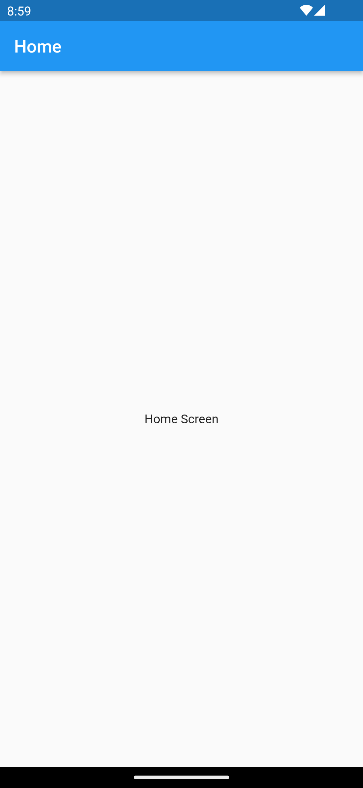
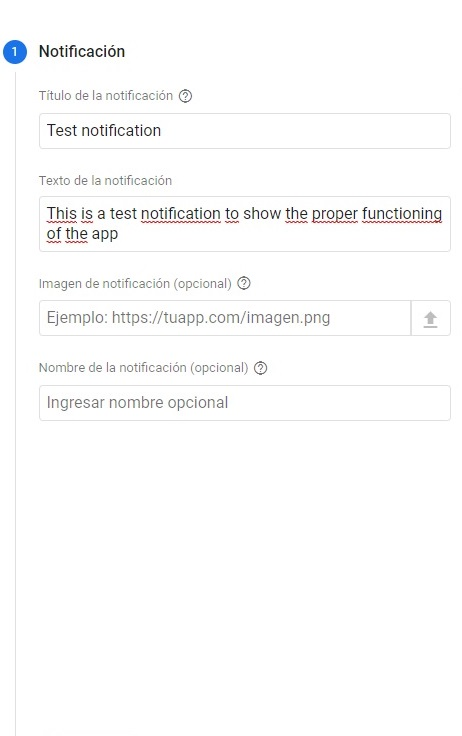
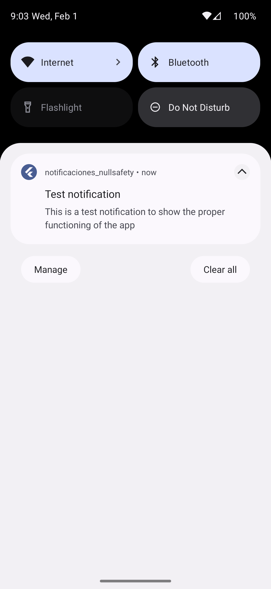
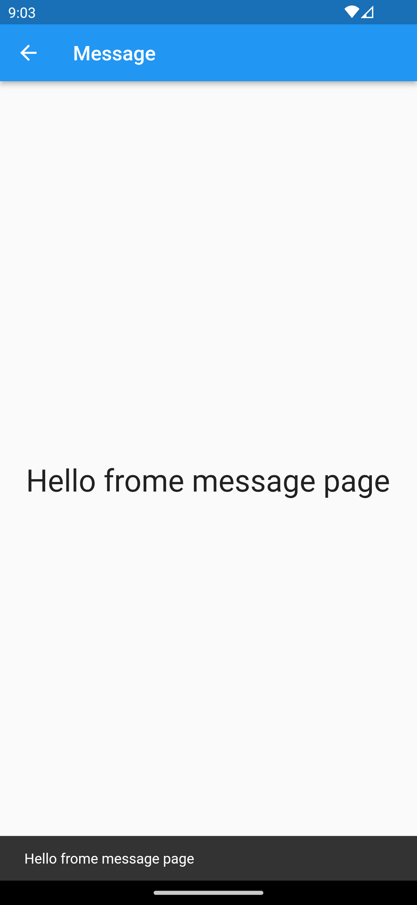

# Notifications Firebase Cloud Messaging

This is an app that demonstrates the use of Firebase and Flutter. It uses Cloud Messaging to send notifications to users' devices. It requires specific packages and configurations in specific files. It is a simple app, but with a complex backend for sending notifications. The interface is not the most important thing, since the application is just a demo.

  
  
  
  

